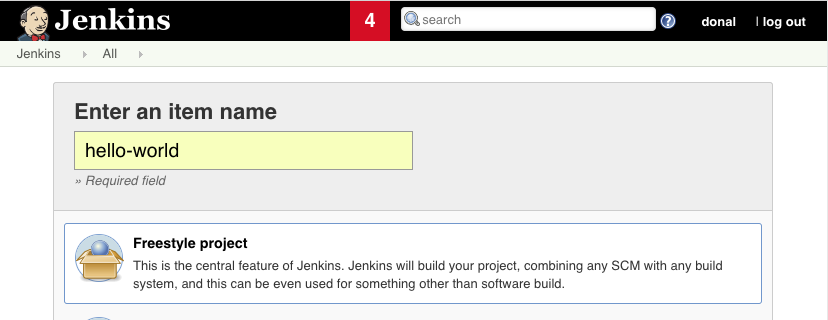
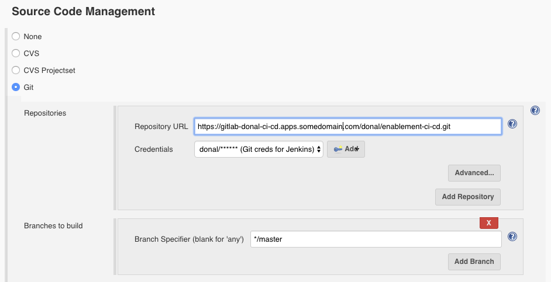
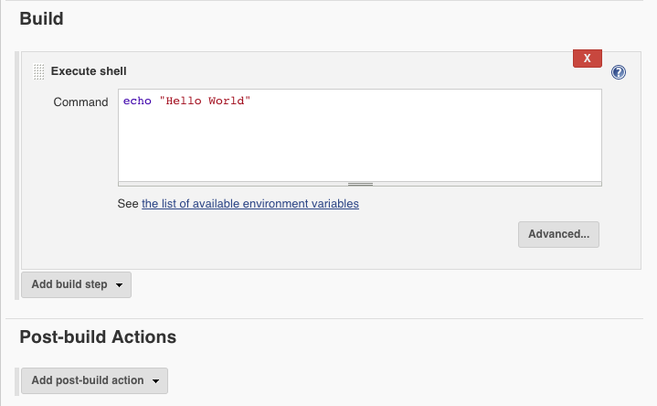
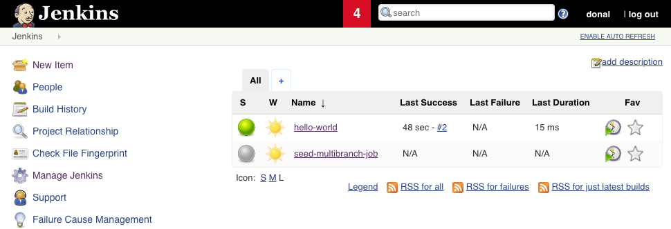

> _To test things are working end-to-end; create a hello world job that doesn't do much but proves we can pull code from git and that our balls are green._

6. Log in to Jenkins and hit `New Item` .

6. Create a freestyle job called `hello-world` .

6. On the Source Code Management tab; add your `enablement-ci-cd` git repo and hit the dropdown to add your credentials we baked into the s2i on previous steps 

6. On the build tab add an Execute Shell step and fill it with `echo "Hello World"` .

6. Run the build and we should see if pass successfully and with Green Balls! 
